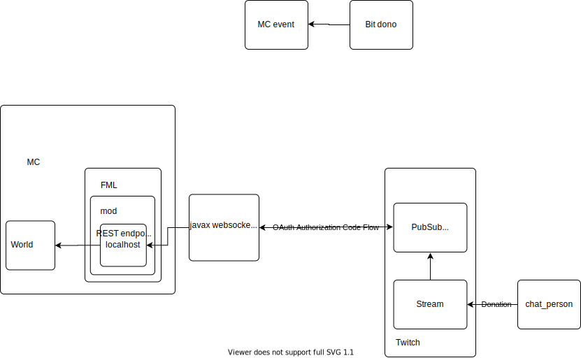

### DIYCrowdControl MC

#### Purpose
It's actually not super hard to create something like this and I didn't see any tutorials so I thought I'd show people how! I'm planning on making a quick youtube series on this as well. This is a codebase just to look at for reference when attempting projects similar.

### Sections:
   0. Structure
   1. Mod
   2. REST
   3. Websocket
   
### Structure
I'll using a Websocket connection to connect to Twitch's PubSub service to listen for stream events from a specific stream, and then using those events as triggers to communicate with a REST endpoint on localhost which is integrated with a Forge Mod Loader 1.14.4 mod that actually modifies the game. The REST endpoint will act as an interface that can be used generically for any game, and the game must figure out a way to implement the features specified in the REST endpoint on its own. 

   
#### Mod
To actually accomplish modifying the game you need to be able to _access_ the game which I've done through the Forge Mod Loader API, specifically 1.14.4. All this does is initalize the REST endpoint and pass the Server object to the REST endpoint when a server is initialized.

#### REST
I use Spark to create a REST endpoint that allows GET on /command/:command and parse the command to interact with the mod.

#### Websocket
I will set up a websocket to listen to the twitch pubsub service for specific events. These events will cause GET/POST requests to the REST endpoint set up that modifies the state of the game.
